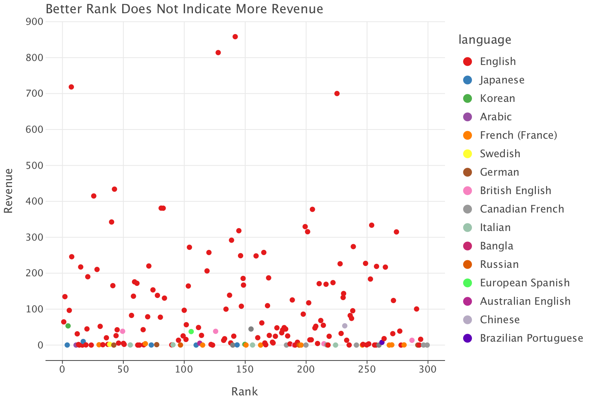

# Rotten Tomatoes Top 300 Movies Analysis

Welcome to my analysis of Rotten Tomatoes' top 300 movies of all time. This project was in collaboration with Mert Tarim, as we collected information on every movie's reception and general statistics. I used our data collection and manipulation to analyze the interplay of audience and critic reviews of these movies and sought insight into which variables might hint at a movie's success. 

## Introduction

As the movie industry makes a comeback from post-pandemic struggles in theaters, public interest in movies has increased. I also have recently been more interested in watching and analyzing movies, so I wanted to identify characteristics of successful movies using Rotten Tomatoes' general information on movies. This analysis explores how critics and audience see the top mvies and what can indicate their success.

## Methodology

The data was collected from the Rotten Tomatoe top 300 movies list and within each movie's individual pages. The information covered included movie title, rank, directors, speechwriters, revenue, ratings, and even more technical details. The analysis includes:

- Critic vs Audience Scores
- Trends over time, revenue, language

## Results

### Critics vs Audience

- **Revenue and Audience Score**: There seems to be a positive relationship between a movie's revenue and audience score, and this makes sense, as better performing movies are a result of audience members appreciting them.
- **Revenue and Critics Score**: The relationship between revenue and critics score is not quite obvious. This indicates that not only may critics score differ from the audience, but also that their opinions don't correlate with a movie's financial success.
- **Audience Score vs Critics Score**: This plot confirms that critics and audience members don't necessarily have the same exact opinions on movies. 
- **Difference in Mean Ratings Across Genres**: We see that across different genres, critics appreciate different types of movies more than the audience. Interestingly, musicals and horror films were overwhelmingly higher rated by critics. It's also not too surprising that critics favored these movies more across all genres as the list was compromised by the top 300 movies in the critics perspective.

### Other Trends

- **Rank and Revenue**: Better ranked movies don't correspond with higher revenues. This reaffirms that critics opinions don't match audience reception entirely.
- **Rank and Runtime**: The runtime of movies and their ranks have no correlation. All English spoken movies were removed to observe trends of the foreign movies selected. There's no obvious pattern among different language in terms of success or runtime.
- **Move Theater Release Date and Rank**: Critics do not prefer movies from any specific time period.
- **Runtime Distribution Across Genres**: Movie genres seem to have distinctive runtime distriubtions. This can be possibly that movies within the same genre cover similar storylines which require certain screentimes. 

## Discussion

The analysis reveals that movie critics and regular audience members have noticeably different opinions on movies. As the financial success of movies is mainly dependent on audience reception, it would be interesting to see how directors and production companies try to tailor to their interests and whether that would conflict with critics. The most distinctive differences among movies fall across genres, and the runtime, language, and release dates seem to have no strong affect on ratings.

## Conclusion

This study provides insights into the review trends of the top movies within Rotten Tomatoes' ranking. Understanding these trends can help producers know what types of movies succeed and make the most money. I could further analyze this data set by looking into the age-ratings and maybe even technical aspects like the aspect ratios. Further studies could include the analysis of movie plots using summary descriptions. Overall, this analysis provides a foundation for which directions to further explore successful movies.

## Acknowledgements

I would like to thank my teammate Mert Tarim for being an awesome teammate.

## Generative AI Acknowledgement

This assignment was completed with the assistance of ChatGPT.

More specifically, I used it in the following way:

- I had syntatical erros when I was trying to read the SQL tables I created and tried to merge htem into a single dataframe. ChatGPT corrected the syntax of my code for reading from the database.